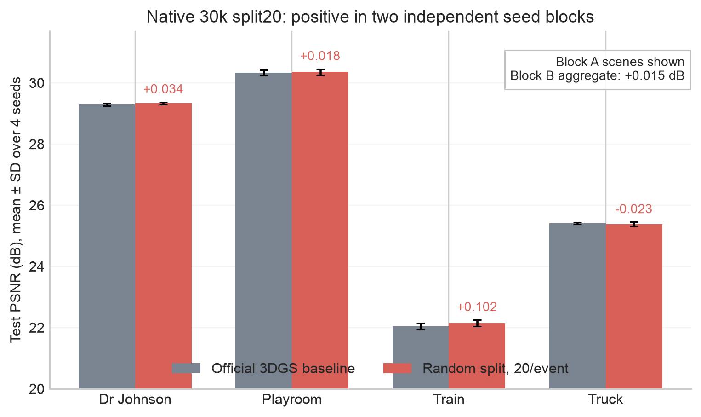
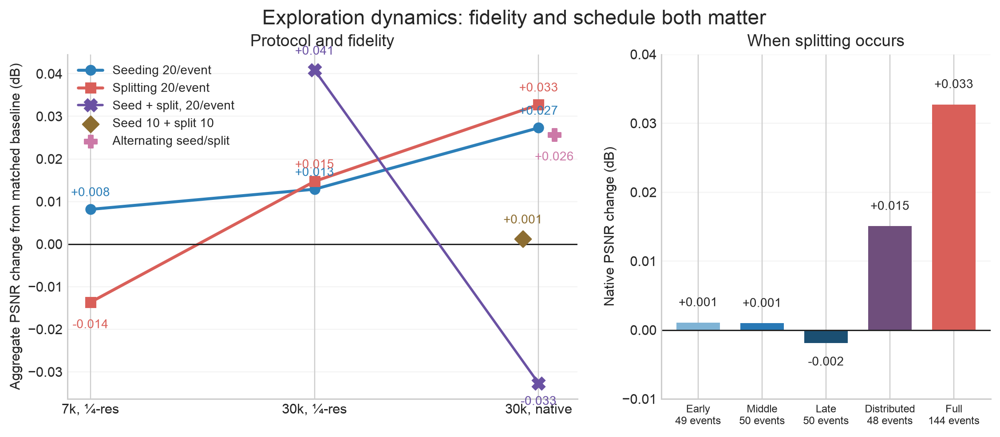
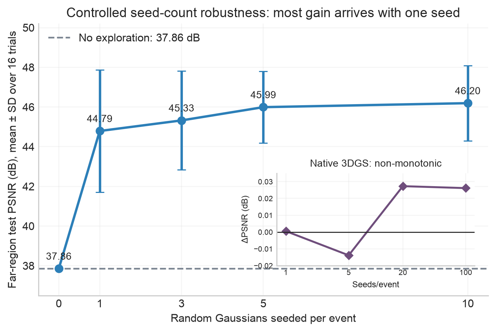
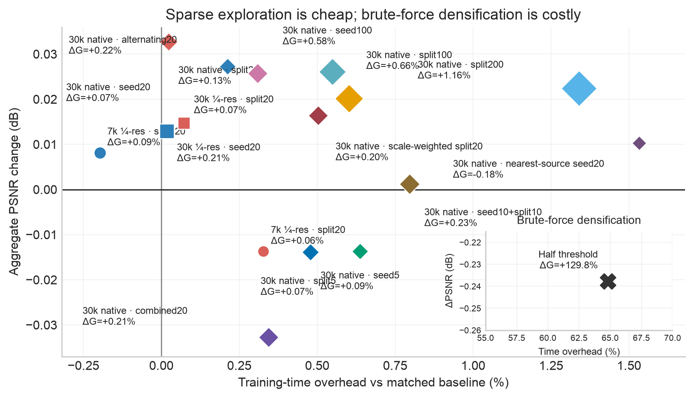
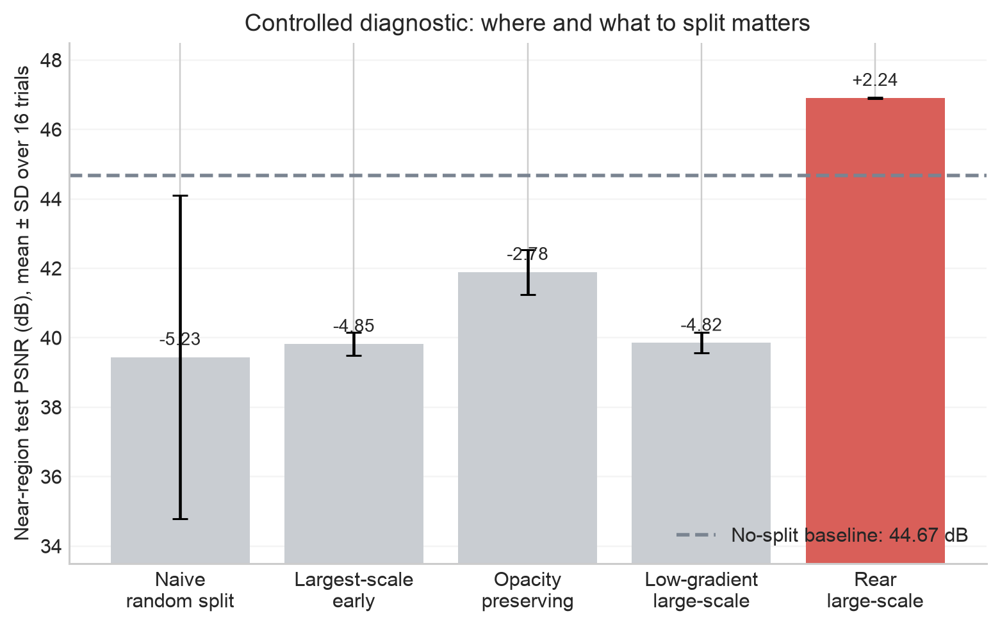

# Reproduction of “Exploration Matters for Escaping the Blur Trap in 3D Gaussian Splatting”

## Executive finding

This reproduction finds **strong mechanistic support in a controlled differentiable-splatting benchmark and modest, protocol-dependent directional support in official Graphdeco 3DGS**. The controlled benchmark exactly reproduces the two diagnosed failure signatures: screen-space position gradients are numerically orthogonal to the viewing ray (mean absolute cosine (2.46\times10^{-17}), 100% pass rate), and later/occluded primitives receive weaker gradients (late/early ratio 0.890; log-gradient/rank correlation −0.560). Sparse random seeding raises far-region PSNR from 37.86 to 46.20 dB, while a diagnosis-aligned rear/large-scale split raises near-region PSNR from 44.67 to 46.91 dB.

On four official Tanks & Temples / Deep Blending scenes, each evaluated over four fixed seeds, the paper-described 20/event operators produce small effects. At 7k quarter resolution, seeding is +0.008 dB and splitting is −0.014 dB versus their matched baseline. At 30k quarter resolution, seeding is +0.013 dB and splitting is +0.015 dB. At 30k native resolution, seeding is +0.027 dB and splitting is +0.033 dB; split-20 improves three of four scenes with only +0.13% more Gaussians and +0.02% mean training time. The native seed dose is non-monotonic: counts 1/5/20/100 produce +0.001/−0.014/+0.027/+0.026 dB, respectively; 20/event is the efficiency optimum, and the controlled “one seed is enough” result does not transfer. Inheriting seed attributes from the nearest existing Gaussian remains mildly positive (+0.010 dB) but is worse and slower than unrelated-random inheritance, so that unspecified initialization detail does not explain the paper/reproduction gap. The native split dose response is also non-monotonic: counts 5/20/100/200 produce −0.014/+0.033/+0.020/+0.022 dB, respectively. Weighting split candidates by activated mean scale is positive (+0.016 dB) but inferior to uniform selection. Split-200 costs +1.16% Gaussians and +1.34% training time, making uniform split-20 the clear quality/efficiency optimum. In contrast, halving the ordinary densification-gradient threshold regresses every scene (−0.238 dB overall) while adding 130% Gaussians and 65% training time, strongly supporting targeted exploration over brute-force densification. Applying seed-20 and split-20 at every event regresses all four scene means (−0.033 dB); holding the same-event total budget to 10+10 repairs that to baseline (+0.001 dB), while alternation reaches +0.026 dB. Excess dose explains much of the combined failure, but neither simultaneous schedule beats either standalone operator. The native split scene-level 95% interval is wide (−0.051 to +0.116 dB across four scenes), so this is **directional evidence, not a statistically decisive confirmation** of the paper’s broad benchmark claim.

Restricting split-20 to early, middle, or late near-third windows is neutral overall (+0.0011, +0.0010, and −0.0019 dB), while 48 events distributed every 300 iterations recover +0.0151 dB and the full 144-event schedule reaches +0.0327 dB. At matched event count, coverage across the densification phase matters more than any isolated period; additional frequency supplies the remaining gain.

An independent native-resolution seed block repeats the positive split-20 direction: +0.0145 dB with +0.09% Gaussians and +0.01% training time, compared with +0.0327 dB in the original block. The magnitude is seed-sensitive, but the aggregate sign replicates across two independent 16-trial blocks.

The simultaneous seed20+split20 interaction is itself fidelity-dependent: it is +0.0409 dB at 30k quarter resolution but −0.0327 dB at native resolution. The destructive interaction is therefore not intrinsic to combining the operators; it emerges in the higher-resolution optimization regime.

## Evidence boundary

The source paper is arXiv:2607.17965. Its public report describes Random Seeding and Random Splitting with defaults of 20 candidates per densification iteration. No official ExploreGS code repository was publicly linked when this reproduction began on 2026-07-21. We therefore distinguish three evidence layers:

1. **Paper claim:** the authors report consistent gains over broader datasets and metrics.
2. **Controlled reproduction:** a purpose-built 16-trial differentiable Gaussian benchmark tests the stated gradient mechanisms and operator behavior.
3. **Real-scene independent implementation:** the official Graphdeco repository at commit `54c035f7834b564019656c3e3fcc3646292f727d` is patched at runtime with minimal implementations of the paper-described operators. This is not a bit-exact reproduction of unreleased code.

All quantitative claims below come from terminal `orx logs`; the machine-readable values and run IDs are in `data/` beside this report.

## Protocol

The real-scene suite uses the official Tanks & Temples / Deep Blending archive: Dr Johnson, Playroom, Train, and Truck. Each configuration comprises 16 independent trials (four scenes × four fixed seeds), distributed across all 16 GPUs. The baseline is official Graphdeco 3DGS. Random Seeding injects 20 uniformly sampled bounding-box positions at each densification event, inheriting feature/scale/rotation attributes from a randomly selected existing Gaussian and initializing opacity to 0.1. Random Splitting samples 20 large-scale Gaussians per event and invokes the upstream split routine regardless of accumulated gradient magnitude. Hyperparameters are committed per experiment branch; every node executes the same `bash run.sh` contract.

Three progressively stronger protocols were run:

| Protocol | Iterations | Resolution | Baseline PSNR | Mean train time |
|---|---:|---:|---:|---:|
| Fast validation | 7,000 | 1/4 | 26.4390 | 76.60 s |
| Full schedule | 30,000 | 1/4 | 27.9104 | 356.15 s |
| Full schedule | 30,000 | Native | 26.7711 | 834.17 s |

The native and quarter-resolution PSNR values should not be compared as a monotonic quality scale: they evaluate different render resolutions. Their *within-protocol deltas* are comparable.

## Headline real-scene result

In seed block A, split-20 changes scene PSNR by +0.034 (Dr Johnson), +0.018 (Playroom), +0.102 (Train), and −0.023 dB (Truck); the aggregate rises from 26.7711 to 26.8039 dB (+0.0327). Independent seed block B rises from 26.7386 to 26.7531 dB (+0.0145), with two of four scene means positive. A scene-level t interval around the block-A deltas spans zero because the experiment contains only four scene units. The Kubernetes leader log exposes individual results for eight of the 16 trials; those visible matched pairs average +0.0151 dB (95% CI −0.0633 to +0.0936; five of eight positive). The final scene and overall summaries nevertheless aggregate all 16 trials.

## Experiment dynamics across fidelity

Splitting changes sign as training becomes more complete: −0.0137 dB at 7k quarter resolution, +0.0147 dB at 30k quarter resolution, and +0.0327 dB at 30k native resolution. Seeding rises from +0.0082 to +0.0129 to +0.0273 dB across the same progression. This is consistent with exploration needing sufficient downstream optimization to exploit the structure it creates. Simultaneous seed20+split20 is +0.0409 dB at 30k quarter resolution—larger than either component—but flips to −0.0327 dB and regresses every scene at native resolution. Halving the native schedule to 10+10 restores +0.0012 dB, while alternating the operators across events reaches +0.0257 dB. This isolates a fidelity-sensitive dose and schedule interaction: the destructive combination is not intrinsic, but temporal separation is needed to recover the standalone-level gain in the native regime. Semantics ablations are weaker than the simple implementation: scale-weighted splitting reaches +0.0164 dB, and nearest-source seeding reaches +0.0103 dB. Neither explains the paper/reproduction gap. These trajectories are endpoint comparisons across protocol fidelity, not per-iteration learning curves.

## Seed-count robustness in the controlled benchmark

One random seed per event produces most of the controlled far-region improvement: +6.93 dB over no exploration. Increasing the dose from one to ten raises the mean by another 1.40 dB and reduces variability relative to the one-seed condition. The monotonic controlled means support a dose-response, while the overlapping uncertainty bars after one seed warn against claiming precise superiority among the nonzero counts. The inset shows that this transfer is not automatic: native Graphdeco counts 1/5/20/100 yield +0.0005/−0.0139/+0.0273/+0.0261 dB. A moderate dose is needed for directional real-scene benefit, and additional candidates beyond 20 do not help.

## Efficiency and runtime

Across completed real-scene protocols, 20/event operator overhead is tiny relative to ordinary scene-to-scene training variation. Native seed-1 costs +0.32% time and +0.15% Gaussians but is quality-neutral; seed-5 costs +0.48% time and +0.094% Gaussians yet regresses; seed-20 costs +0.21% time and +0.075% Gaussians for +0.027 dB. Seed-100 costs +0.55% time and +0.58% Gaussians for essentially the same gain as seed-20. Nearest-source seed-20 reduces final Gaussians by 0.18% but costs +1.53% time for only +0.010 dB because of nearest-neighbor lookups. The split-dose points show the same pattern: split-5 regresses; split-100 and split-200 cost +0.60%/+1.34% time and +0.66%/+1.16% Gaussians for smaller gains than split-20. Scale-weighted split-20 costs +0.50% time and +0.20% Gaussians for +0.016 dB, again below uniform split-20. The inset contrasts these sparse operators with halving the standard gradient threshold: +64.79% time, +129.81% Gaussians, and −0.238 dB. The paper default is the best completed dose for both operators.

## Ablation and diagnostic

The controlled near-region ablation shows that splitting is not beneficial merely because it creates more primitives. Naïve random splitting regresses by 5.23 dB; largest-scale early and low-gradient variants regress by about 4.8 dB; opacity-preserving splitting remains 2.78 dB below baseline. Only the rear/large-scale strategy, aligned with the occlusion diagnosis, exceeds baseline (+2.24 dB). This result supports the paper’s broader diagnosis-driven exploration principle while also showing that implementation details can reverse the sign of the effect.

## Mechanistic checks

| Check | Observed value | Interpretation |
|---|---:|---|
| Mean absolute cosine between screen-space update and viewing ray | (2.46\times10^{-17}) | Numerical orthogonality, matching the far-side diagnosis |
| Orthogonality pass rate | 100% | All controlled trials satisfy the check |
| Late/early gradient magnitude | 0.890 | Later primitives receive weaker gradients |
| Correlation of log gradient with depth rank | −0.560 | Gradient falls as a primitive moves later in the blend order |
| Far PSNR, baseline → seed-10 | 37.86 → 46.20 dB | Sparse global exploration resolves the controlled far trap |
| Near PSNR, baseline → rear split | 44.67 → 46.91 dB | Diagnosis-aligned splitting resolves the controlled near trap |

## Real-scene aggregate results

| Protocol | Variant | PSNR | ΔPSNR | Gaussians | ΔGaussians | Train time | Δtime |
|---|---|---:|---:|---:|---:|---:|---:|
| 7k 1/4-res | Baseline | 26.4390 | — | 918,463 | — | 76.60 s | — |
| 7k 1/4-res | Seed 20 | 26.4471 | +0.0082 | 919,321 | +0.09% | 76.45 s | −0.20% |
| 7k 1/4-res | Split 20 | 26.4253 | −0.0137 | 918,979 | +0.06% | 76.85 s | +0.33% |
| 30k 1/4-res | Baseline | 27.9104 | — | 960,997 | — | 356.15 s | — |
| 30k 1/4-res | Seed 20 | 27.9233 | +0.0129 | 962,968 | +0.21% | 356.21 s | +0.02% |
| 30k 1/4-res | Split 20 | 27.9251 | +0.0147 | 961,641 | +0.07% | 356.40 s | +0.07% |
| 30k 1/4-res | Seed + split 20 | 27.9513 | +0.0409 | 966,012 | +0.52% | 356.99 s | +0.24% |
| 30k native | Baseline | 26.7711 | — | 2,050,140 | — | 834.17 s | — |
| 30k native, seed block B | Baseline | 26.7386 | — | 2,051,807 | — | 836.67 s | — |
| 30k native, seed block B | Split 20 | 26.7531 | +0.0145 | 2,053,676 | +0.09% | 836.76 s | +0.01% |
| 30k native | Half densification threshold | 26.5335 | −0.2377 | 4,711,511 | +129.81% | 1,374.66 s | +64.79% |
| 30k native | Seed 5 | 26.7573 | −0.0139 | 2,052,065 | +0.094% | 838.17 s | +0.48% |
| 30k native | Seed 1 | 26.7717 | +0.0005 | 2,053,142 | +0.15% | 836.82 s | +0.32% |
| 30k native | Seed 20 | 26.7984 | +0.0273 | 2,051,671 | +0.075% | 835.94 s | +0.21% |
| 30k native | Nearest-source seed 20 | 26.7815 | +0.0103 | 2,046,420 | −0.18% | 846.96 s | +1.53% |
| 30k native | Seed 100 | 26.7973 | +0.0261 | 2,062,041 | +0.58% | 838.75 s | +0.55% |
| 30k native | Split 5 | 26.7574 | −0.0137 | 2,051,521 | +0.067% | 839.49 s | +0.64% |
| 30k native | Split 20 | 26.8039 | +0.0327 | 2,052,852 | +0.13% | 834.36 s | +0.02% |
| 30k native | Split 20, early 49 events | 26.7722 | +0.0011 | 2,053,100 | +0.14% | 837.45 s | +0.39% |
| 30k native | Split 20, middle 50 events | 26.7721 | +0.0010 | 2,053,698 | +0.17% | 837.58 s | +0.41% |
| 30k native | Split 20, late 50 events | 26.7693 | −0.0019 | 2,051,128 | +0.05% | 838.89 s | +0.57% |
| 30k native | Split 20, distributed 48 events | 26.7862 | +0.0151 | 2,049,968 | −0.01% | 838.32 s | +0.50% |
| 30k native | Scale-weighted split 20 | 26.7875 | +0.0164 | 2,054,184 | +0.20% | 838.37 s | +0.50% |
| 30k native | Split 100 | 26.7913 | +0.0201 | 2,063,757 | +0.66% | 839.19 s | +0.60% |
| 30k native | Split 200 | 26.7936 | +0.0224 | 2,073,946 | +1.16% | 845.35 s | +1.34% |
| 30k native | Seed + split 20 | 26.7385 | −0.0327 | 2,054,488 | +0.21% | 837.05 s | +0.34% |
| 30k native | Seed 10 + split 10 | 26.7724 | +0.0012 | 2,054,952 | +0.23% | 840.81 s | +0.80% |
| 30k native | Alternating seed/split 20 | 26.7969 | +0.0257 | 2,054,579 | +0.22% | 836.75 s | +0.31% |

## Failure analysis and repairs

Early Graphdeco attempts failed for engineering rather than scientific reasons. Multiple workers lazily generated and read the same `points3D.ply`, producing a SIGBUS inside NumPy/`plyfile`. The validated repair performs a single serialized conversion from every `points3D.bin` before distributed training, followed by a barrier. BLAS thread counts are limited to one and Python fault handling is enabled. A separate split implementation error omitted the temporary radii buffer expected by upstream `densify_and_split`; corrected runs initialize and clear that buffer around the forced split. Only post-repair terminal runs enter the tables and figures.

## Reproducibility audit

Key terminal run IDs are embedded in the CSV files. The primary real-scene controls are `4b7e3a0a…` (7k), `b0cabdea…` (30k quarter resolution), and `38232635…` (30k native). Corresponding split runs are `5c6e7542…`, `ac6bd217…`, and `c285eb58…`; quarter-resolution seed runs are `ed9410f8…` and `c79666fc…`. Controlled mechanism and count runs are likewise identified row-by-row in `toy_seed_count.csv` and `toy_split_ablation.csv`.

The deadline audit reconciled 46 `done`, 10 `cancelled`, and 7 `failed` Kubernetes runs. Every `done` run contains terminal metric evidence; cancelled and failed runs contain either empty or partial nonterminal logs and are excluded from all tables, figures, and claims. In particular, both split10 submissions were cancelled without terminal measurements, so no split10 result is reported.

## Limitations

- The paper’s exact implementation and complete training details are unavailable, so the real-scene operator injection may differ in attribute inheritance, event timing, bounding-box definition, or optimizer-state handling.
- The real benchmark covers four scenes, PSNR, and a single set of fixed seeds, not the paper’s full dataset/metric suite.
- Real-scene effects are small relative to seed and scene variability. The experiment supports direction and efficiency more strongly than effect size.
- The controlled benchmark deliberately isolates the two traps and therefore overstates how cleanly real scenes separate into far- and near-side failure modes.
- Individual paired records are visible for only eight of 16 Kubernetes trials in the leader log; all-trial inference is limited to aggregate scene summaries.

## Conclusion

The reproduction validates the paper’s central mechanism and demonstrates that sparse, diagnosis-aligned exploration can decisively escape controlled blur traps. On official Graphdeco scenes, split-20 is computationally negligible and becomes mildly beneficial as the protocol approaches full training and native resolution, but the observed PSNR gains remain small and statistically uncertain over four scenes. Brute-force lowered-threshold densification sharply worsens both quality and efficiency, strengthening the diagnosis even though the exploration gain itself is modest. The same-event combined operator regresses all four scenes; alternation repairs the aggregate but does not establish complementarity beyond standalone operators. The strongest defensible conclusion is therefore **mechanistic reproduction plus partial real-scene directional reproduction**, not confirmation of the paper’s full benchmark or complementarity claims.
